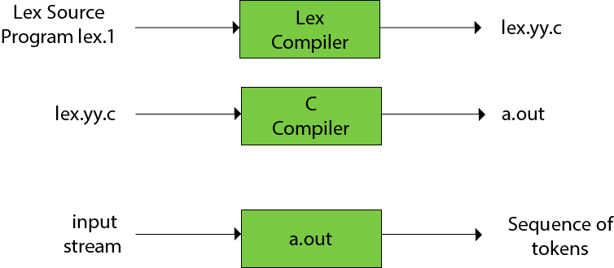
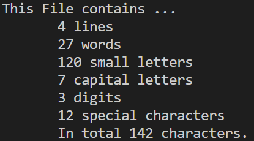
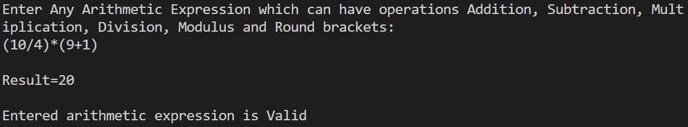

# EX1
## Aim: Study of Lex and Yacc tools
## Theory:
### LEX 

1. Lex is a program that generates lexical analyser. It is sometimes used with yacc parser generator.
1. The lexical analyzer is a program that transforms an input stream into a sequence of tokens
1. It reads the input stream and produces the source code as output through implementing the lexical analyzer in the C program.



### Lex file format
A Lex program is separated into three sections by %% delimiters. The formal of Lex source is as follows:
```
{ definitions }   
%%  
 { rules }   
%%   
{ user subroutines }
```  
Definitions include declarations of constant, variable and regular definitions.

Rules define the statement of form p1 {action1} p2 {action2}....pn {action}.

Where pi describes the regular expression and action1 describes the actions what action the lexical analyzer should take when pattern pi matches a lexeme.

let's code

Program to count the number of lines , words , digits, characters , etc...



---


### YACC

1. YACC stands for Yet Another Compiler Compiler.
1. YACC provides a tool to produce a parser for a given grammar.
1. YACC is a program designed to compile a LALR (1) grammar.
1. It is used to produce the source code of the syntactic analyzer of the language produced by LALR (1) grammar.
1. The input of YACC is the rule or grammar and the output is a C program.

The file contains the following sections:
- Declarations section. This section contains entries that:
1. Include standard I/O header file
2. Define global variables
3. Define the list rule as the place to start processing
4. Define the tokens used by the parser
5. Define the operators and their precedence
- Rules section. The rules section defines the rules that parse the input stream.
1. %start - Specifies that the whole input should match stat.
2. %union - By default, the values returned by actions and the lexical analyzer are integers. yacc can also support values of other types, including structures. In addition, yacc keeps track of the types, and inserts appropriate union member names so that the resulting parser will be strictly type checked. The yacc value stack is declared to be a union of the various types of values desired. The user declares the union, and associates union member names to each token and nonterminal symbol having a value. When the value is referenced through a $$ or $n construction, yacc will automatically insert the appropriate union name, so that no unwanted conversions will take place.
3. %type - Makes use of the members of the %union declaration and gives an individual type for the values associated with each part of the grammar.
4. %toksn - Lists the tokens which come from lex tool with their type.

let's code
implementing a simple calculator program



---