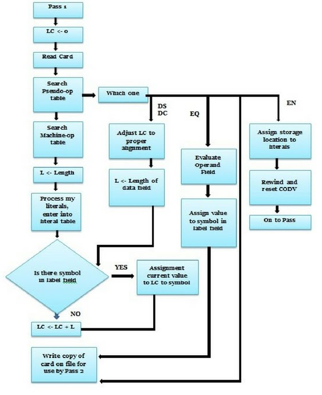
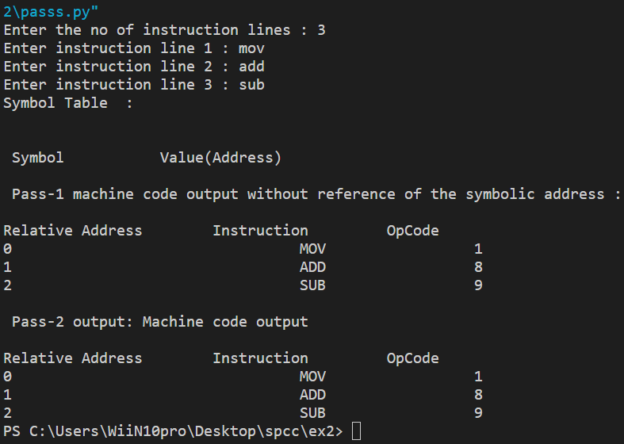

# EX2
---
## Aim: Write a program to implement PASS1/PASS2 of a Two Pass Assembler
---
## Theory

Two pass translation:

    • Two pass translations consist of pass I and pass II.

    • Generally, LC processing performed in the first pass and symbols defined in the program entered into the symbol table, hence first pass performs analysis of the source program.

    • So, two pass translation of assembly lang. the program can handle forward reference easily.

    • The second pass synthesizes the target form using the address information found in the symbol table.

    • Moreover, The first pass constructs an intermediate representation of the source program and that will be used by the second pass.

    • IR consists of two main components: data structure + IC (intermediate code)

Single-pass translation

    • Similarly, A one-pass assembler requires 1 scan of the source program to generate machine code.

    • Moreover, The process of forwarding references talked using a process called back patching. The operand field of an instruction containing forward references left blank initially

---

## Output

