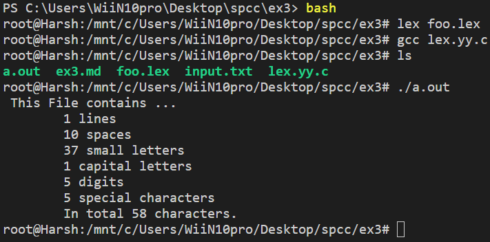

# EX3

## Aim: Write a program to count number of characters, words, sentences, lines, spaces, numbers present in a input using LEX program

---

## Theory

- What is Lex?

LEX is a program generator designed for lexical processing of character input/output stream. Anything from simple text search program that looks for pattern in its input-output file to a C compiler that transforms a program into optimized code.

It is a tool or software which automatically generates a lexical analyzer (finite Automata). It takes as its input a LEX source program and produces lexical Analyzer as its output. Lexical Analyzer will convert the input string entered by the user into tokens as its output.

---

now lets code

---
## Results

### input.txt

### output

---
