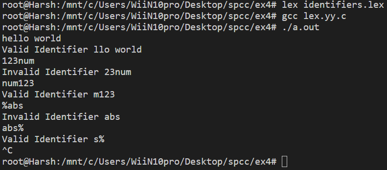

# EX4

## Aim: Write LEX program to recognize identifiers of C language using symbol table

---

## Theory:

Lex is a computer program that generates lexical analyzers and was written by Mike Lesk and Eric Schmidt. Lex reads an input stream specifying the lexical analyzer and outputs source code implementing the lex in the C programming language.

In C, an identifier must begin with either an alphabet or underscore, it can not begin with a digit or any other special character, moreover digits can come after

---

## Result

